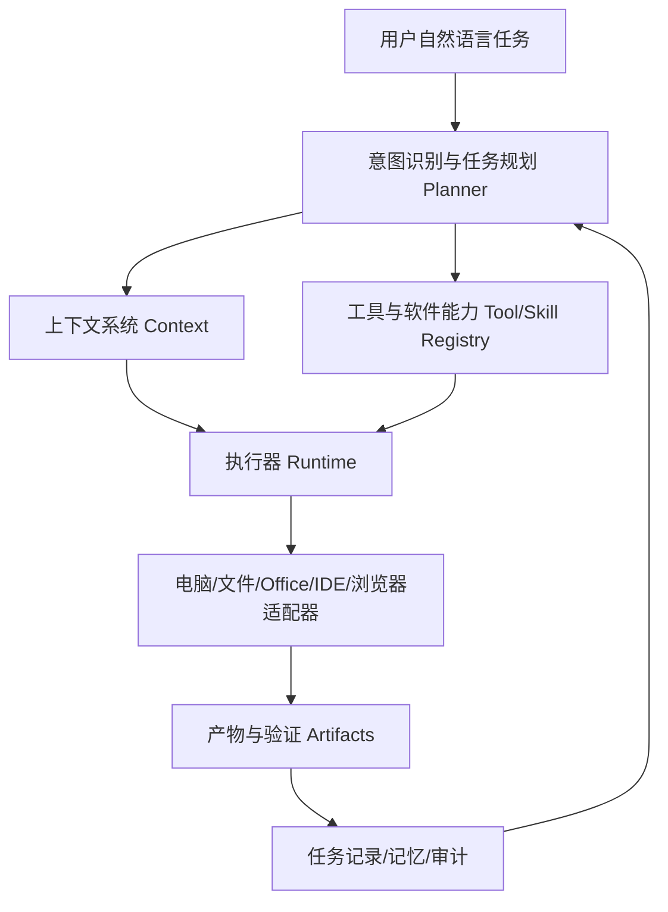

# DNA Work Agent 平台级蓝图

这份文档用于把 DNA Work Agent 从“本地桌面聊天/RAG MVP”升级为“可控制电脑、可调用软件、可生成办公文档、可编程、可执行多步骤工作流”的本地工程技术 Agent 平台。

## 1. 为什么现在还不能像成熟 Agent 一样直接干活

当前版本已经有：桌面 UI、SQLite、模型配置、项目管理、文件导入、简单 RAG、标准库、Skill 列表、模板和日志。

但它还缺少真正的“行动层”：

1. 电脑控制层：缺少屏幕识别、窗口定位、鼠标键盘控制、剪贴板、文件管理和进程管理。
2. 软件适配层：只是保存了软件路径，还没有为 PowerPoint、Word、Excel、WPS、PyCharm、VS Code、浏览器建立专门适配器。
3. 文档生成引擎：目前只有 Markdown 模板，没有完整 PPTX/DOCX/XLSX 生成、排版、预览、导出 PDF 的流水线。
4. 任务规划器：还没有 Planner 把“一句话任务”拆解成步骤、工具调用、文件产物、校验点和回滚策略。
5. 执行器和权限系统：还没有统一 Task Runner、操作队列、风险等级、二次确认、审计日志、失败重试。
6. Agent 工作记忆：现在只是数据库表预留，还没有长期偏好、项目上下文、最近文件、常用模板、常用软件路径的主动利用。
7. 结果交付系统：还没有“任务面板、产物列表、预览、打开、导出、重新生成、版本记录”。

因此，现在它像“桌面 Agent 的控制台雏形”，不是完整的“会操作电脑的数字同事”。

## 2. 成熟桌面 Agent 的产品构造

参考 WorkBuddy、Codex、ChatGPT Desktop、Cursor、VS Code AI 助手这类产品，核心不是聊天框，而是六层结构：



### 2.1 入口层

用户看到的是一个工作台，不是普通聊天软件。

必备入口：

- 首页 Dashboard
- Agent 对话
- 任务中心
- 产物中心
- 文件库
- 项目库
- 标准库
- Office 助手
- 编程助手
- 软件控制
- Skill 管理
- 模型管理
- 记忆与设置
- 日志与审计

### 2.2 Planner 任务规划层

把用户一句话拆解为结构化计划。

用户说：“帮我根据这个项目资料做一个投标技术方案 PPT。”

Planner 应拆成：

1. 确认当前项目。
2. 检索项目文件和标准库。
3. 识别投标方案需要的章节。
4. 生成 PPT 大纲。
5. 选择 PPT 模板。
6. 生成每页标题、要点、表格、图示建议。
7. 调用 PPTX 生成器。
8. 渲染预览图。
9. 自检：页数、标题、错别字、内容完整度。
10. 输出 PPTX 文件，记录到产物列表。

Planner 输出应是 JSON：

```json
{
  "task_type": "generate_ppt",
  "risk_level": "medium",
  "requires_confirmation": false,
  "steps": [
    {"id": 1, "name": "检索项目资料", "tool": "rag.search"},
    {"id": 2, "name": "生成大纲", "tool": "llm.chat"},
    {"id": 3, "name": "生成PPT", "tool": "office.pptx.create"},
    {"id": 4, "name": "渲染预览", "tool": "office.pptx.preview"}
  ],
  "expected_artifacts": ["pptx", "markdown_outline"]
}
```

### 2.3 Context 上下文层

Agent 必须知道：当前项目、当前模型、当前任务、当前文件、当前标准库、用户偏好、常用输出格式、最近打开的软件、最近生成的产物、历史对话摘要。

这不是把所有内容塞进 Prompt，而是按任务动态取用。

### 2.4 Tool / Skill Registry 工具注册层

每个能力都要注册元数据：名称、描述、输入 schema、输出 schema、风险等级、是否需要确认、是否可自动执行、超时时间、失败重试策略、日志脱敏策略。

Skill 分组：

1. 文件能力：读文件、写新文件、复制文件、打开文件夹、搜索项目文件。
2. Office 能力：生成 Word、生成 Excel、生成 PPT、渲染预览、导出 PDF。
3. 编程能力：创建代码文件、修改代码文件、运行测试、生成 README、打开 PyCharm / VS Code。
4. 浏览器能力：打开网页、搜索资料、提取网页内容、填写表单。
5. 软件控制能力：打开软件、切换窗口、点击菜单、输入文字、截图识别。
6. 行业能力：查询公路机电标准、生成测试记录、生成质量检验表、生成验收清单、生成投标响应。
7. 系统能力：执行命令、删除文件、覆盖文件。高风险动作必须确认。

### 2.5 Runtime 执行器层

Runtime 负责接收计划、逐步执行、记录输入输出、异常重试、等待确认、生成中间产物、更新 UI 进度、最后交付结果。

任务状态：pending、planning、waiting_confirmation、running、failed、completed、cancelled。

### 2.6 Adapters 软件适配层

软件控制不能只靠“打开 exe”。要分两类：

#### A. 文件级适配器，优先使用

更稳定，更适合第一阶段。

- Word：python-docx 生成 docx
- Excel：openpyxl 生成 xlsx
- PPT：python-pptx 生成 pptx
- PDF：PyMuPDF / reportlab / pypdf
- Markdown：直接写文件
- 代码：pathlib + AST/文本编辑

#### B. GUI 级适配器，后期增加

适合真正“控制电脑”。

- 截图
- OCR
- UI 元素定位
- 鼠标点击
- 键盘输入
- 剪贴板
- 窗口管理
- 软件状态检测

原则：能通过文件 API 完成，就不要模拟鼠标键盘。GUI 自动化作为补充，而不是第一选择。

## 3. DNA Work Agent 应有的完整界面

### 3.1 首页 Dashboard

展示当前项目、当前模型、今日任务、最近产物、最近文件、快捷入口、工程标准库状态、Agent 健康状态。

快捷入口：新建项目、导入资料、导入标准、生成 Word、生成 Excel、生成 PPT、写代码、打开 PyCharm、打开 VS Code、开始多步骤任务。

### 3.2 Agent 对话页

不是普通聊天，而是任务控制台。

区域：

1. 顶部上下文栏：当前项目、当前模型、RAG 开关、标准库开关、自动执行开关、安全模式。
2. 中间对话区：用户消息、Agent 回复、引用来源卡片、工具调用卡片、任务步骤卡片、产物卡片。
3. 右侧任务上下文面板：当前计划、已调用工具、相关文件、输出产物、风险提示。
4. 底部输入区：多行输入、附件、发送、停止、快捷 Prompt。

### 3.3 任务中心

展示任务列表、当前状态、步骤进度、开始时间、结束时间、产物、错误日志、重新运行、继续执行、取消任务。

### 3.4 文件与产物中心

分成输入资料和输出产物。

产物类型：docx、pptx、xlsx、md、txt、pdf、py、zip。

产物操作：预览、打开、打开所在文件夹、重新生成、另存为、加入项目资料库。

### 3.5 Office 工作台

功能：Word 文档生成、PPT 生成、Excel 表格生成、Markdown 转 Word、Word 转 Markdown、PPT 大纲生成、报告模板套用、批量文档生成。

### 3.6 编程工作台

功能：项目目录选择、文件树、代码阅读、代码修改计划、Diff 预览、应用修改、运行测试、打开 PyCharm / VS Code、生成脚本。

原则：代码修改必须有 Diff 预览，默认不覆盖重要文件。

### 3.7 软件控制台

功能：软件注册、启动软件、打开当前项目、执行软件动作、查看动作日志、安全确认。

### 3.8 Skill 管理

功能：Skill 列表、分组、风险等级、输入输出 schema、测试 Skill、启用/禁用、权限策略。

### 3.9 模型管理

功能：多供应商配置、默认模型、连接测试、模型用途分配、成本与速度备注。

模型用途分配：聊天模型、规划模型、代码模型、文档模型、视觉模型。

## 4. 后端模块设计

建议目录：

```text
agent_runtime/
  planner.py
  executor.py
  task_state.py
  tool_registry.py
  permissions.py
  artifacts.py
  events.py

adapters/
  file_adapter.py
  office_word_adapter.py
  office_excel_adapter.py
  office_ppt_adapter.py
  ide_adapter.py
  browser_adapter.py
  desktop_adapter.py
  process_adapter.py

automation/
  window_manager.py
  mouse_keyboard.py
  clipboard.py
  screenshot.py
  ocr.py

artifacts/
  artifact_manager.py
  preview_renderer.py

ui/
  task_center_page.py
  office_page.py
  coding_page.py
  artifact_page.py
```

## 5. 数据库新增表

### task_steps

- id
- task_id
- step_index
- step_name
- tool_name
- input_json
- output_json
- status
- error_message
- started_at
- completed_at

### artifacts

- id
- task_id
- project_id
- artifact_name
- artifact_type
- file_path
- preview_path
- description
- created_at

### tool_calls

- id
- task_id
- tool_name
- input_json
- output_json
- risk_level
- status
- created_at

### software_actions

- id
- software_id
- action_name
- input_json
- status
- created_at

## 6. 第一阶段实现顺序

不要一上来做 GUI 自动点击电脑。先做稳定的“文件级自动化”。

### Phase 1：任务中心 + 产物系统

- 新增任务中心页面
- 新增 artifacts 表
- 所有生成结果统一保存到 data/exports
- 对话页显示任务步骤和产物卡片

### Phase 2：Office 生成器

- python-docx 生成 Word
- openpyxl 生成 Excel
- python-pptx 生成 PPT
- Markdown 作为中间格式
- 生成后打开所在文件夹

### Phase 3：Planner + Executor

- LLM 生成计划 JSON
- 本地规则兜底
- Executor 按步骤调用工具
- UI 显示进度

### Phase 4：编程助手

- 选择代码目录
- 生成/修改代码文件
- Diff 预览
- 运行测试
- 打开 PyCharm/VS Code

### Phase 5：桌面控制

- 截图
- 窗口定位
- 鼠标键盘
- 剪贴板
- OCR
- 高风险确认

### Phase 6：多 Agent

- 文档 Agent
- 编程 Agent
- 标准 Agent
- 现场测试 Agent
- 投标 Agent
- 软件控制 Agent

## 7. 安全原则

1. 默认只读。
2. 写文件默认写到 data/exports，不覆盖原文件。
3. 覆盖、删除、执行命令必须二次确认。
4. API Key 不写死、不完整打印日志。
5. 每次工具调用记录审计日志。
6. 高风险 Skill 默认关闭自动执行。
7. GUI 自动化必须允许用户随时停止。
8. 任务失败必须保留中间结果和错误信息。

## 8. 最终定位

DNA Work Agent 不是普通聊天机器人，而是：

> 面向工程技术人员的本地桌面 Agent 工作台，能管理项目资料、行业标准、办公文档、代码工程和本机软件，并通过安全可审计的工具执行系统，把自然语言任务转化为可交付文件和可复用工作流。
